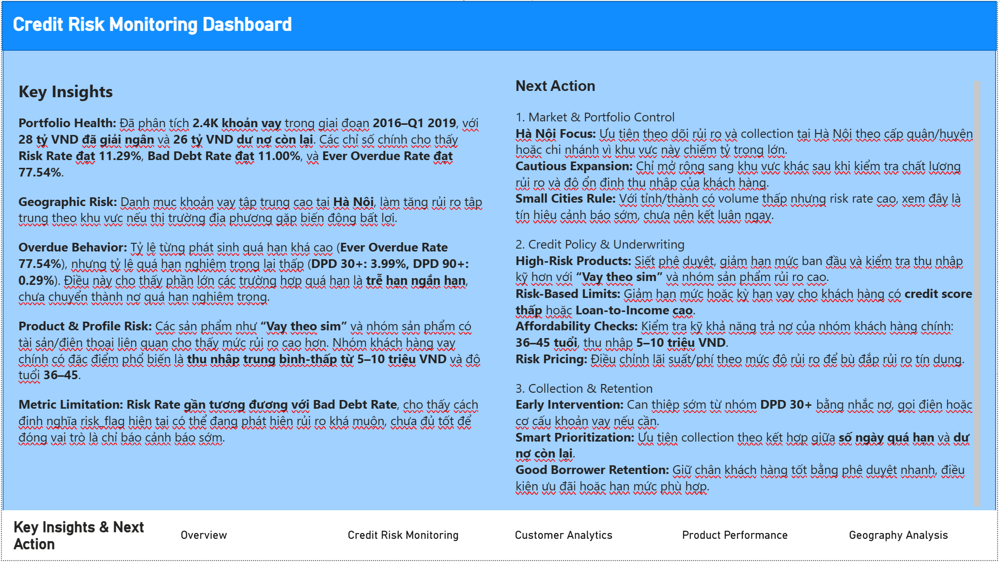
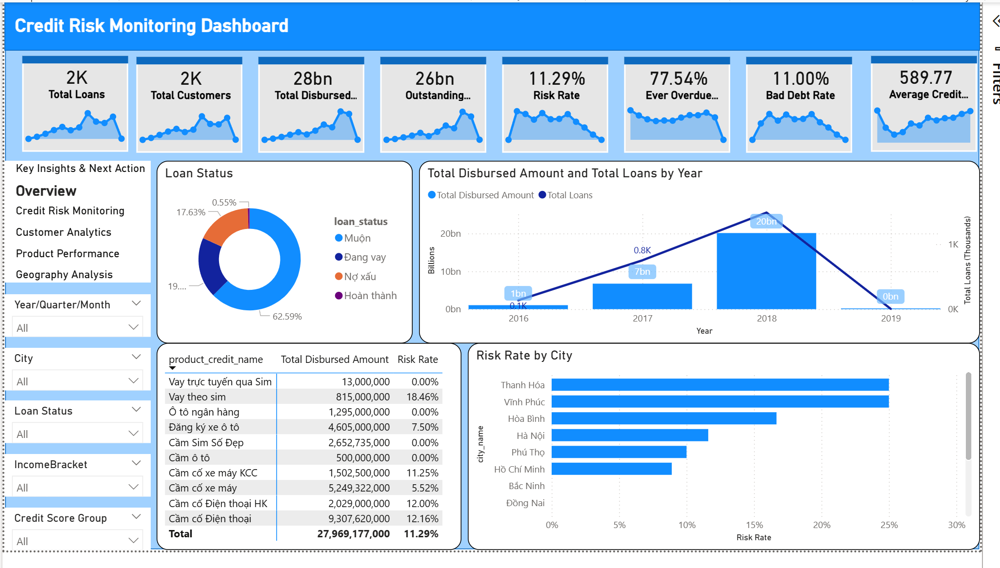
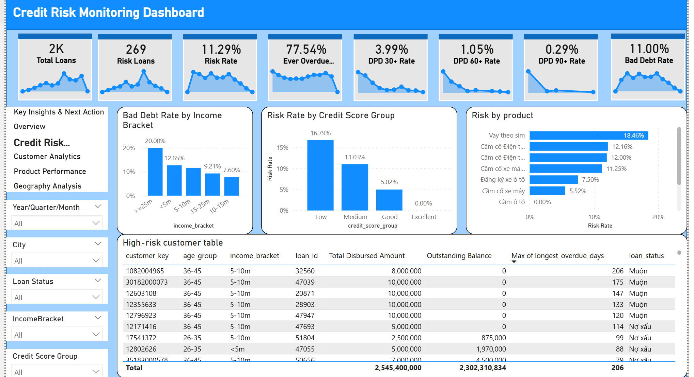
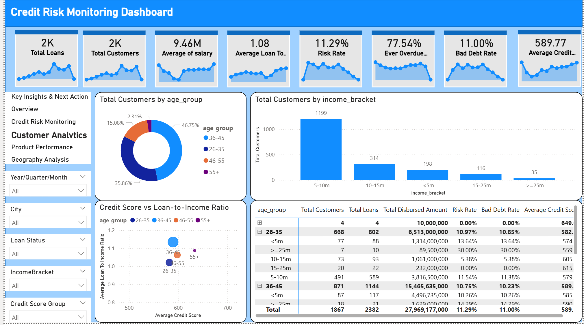
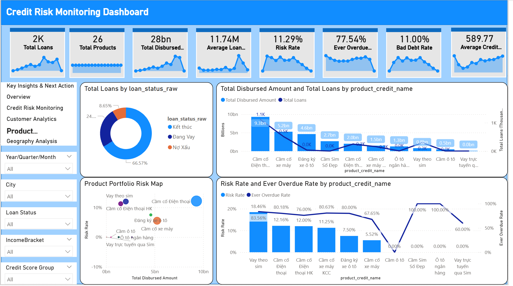
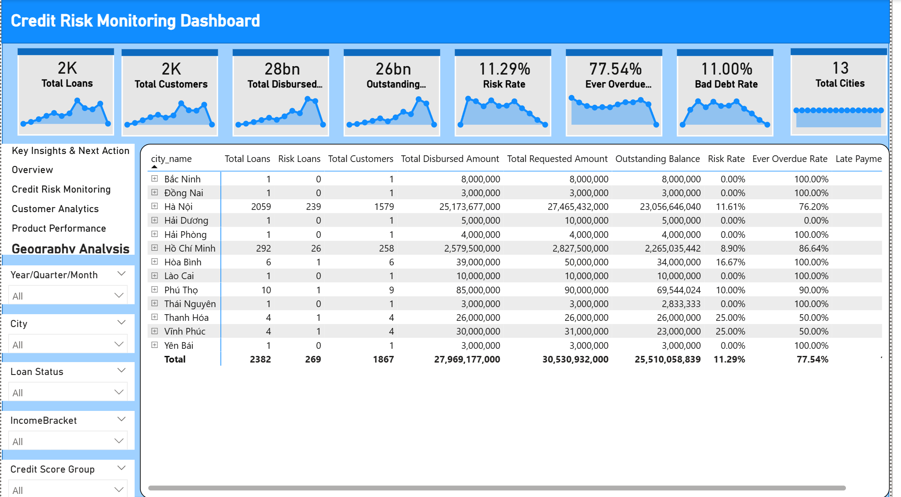

# Banking Credit Risk Analytics & Customer Segmentation

## 1. Project Overview

This project builds an end-to-end banking data analytics workflow, including:

- **3-layer BigQuery Data Warehouse:** Bronze → Silver → Gold.
- **Power BI Dashboard:** Monitor loan portfolio, credit risk, DPD, products, customers, and geography.
- **Machine Learning:** Segment customers using K-Means to support portfolio management and business action prioritization.

The final objective is to transform loan data into dashboards, insights, and customer segments that support risk monitoring, collection, and portfolio strategy.

---

## 2. Key Results

- Built an end-to-end banking analytics pipeline from raw data to dashboard and customer segmentation.
- Designed a 3-layer BigQuery Data Warehouse model: **Bronze → Silver → Gold**.
- Developed a Power BI dashboard with **6 pages** to monitor portfolio, credit risk, DPD, product, customer, and geography performance.
- Analyzed approximately **2.4K loans**, **1,868 customers**, **28bn VND disbursed amount**, and **26bn VND outstanding balance**.
- Monitored key risk KPIs such as **Risk Rate 11.29%**, **Bad Debt Rate 11.00%**, and **Ever Overdue Rate 77.54%**.
- Built a customer segmentation model using **PCA + K-Means**, dividing customers into **4 segments** to support risk monitoring and collection strategy.
- Identified **Cluster 3 - High DPD High Risk** as the highest-risk segment, with **target_risk 26.80%** and **risk_probability 73.35%**.

---

## 3. Business Objectives

This project focuses on answering the following questions:

- How is the loan portfolio growing or declining over time?
- Where is risk concentrated across customer groups, products, or regions?
- What do DPD, overdue behavior, bad debt, and credit score indicate?
- Which customer groups should be prioritized for monitoring or collection?

---

## 4. Tech Stack

| Area | Tools |
|---|---|
| Data Warehouse | Google BigQuery |
| Data Processing | BigQuery SQL |
| BI Dashboard | Power BI |
| ML / Analytics | Python, pandas, scikit-learn, Matplotlib, Seaborn, PCA, K-Means, tree-based models, Gradient Boosting |

---

## 5. End-to-End Flow

```text
Raw Banking Data
→ Bronze Layer
→ Silver Layer
→ Gold Layer
→ Power BI Dashboard
→ Customer Segmentation
→ Business Insights & Next Actions
```

---

## 6. 3-Layer Data Warehouse

### 6.1 Bronze Layer

The Bronze layer stores raw source data with minimal transformation.

Purpose:

- Preserve the original raw data.
- Ensure traceability.
- Serve as the input source for downstream processing.

Main table:

```text
banking_bronze.raw_loan_data
```

---

### 6.2 Silver Layer

The Silver layer cleans and standardizes the data.

Main processing steps:

- Standardize data types: date, numeric, and string.
- Clean loan, customer, salary, credit score, and overdue information.
- Create derived fields such as age, age group, loan term, processing days, income bracket, and credit score group.
- Prepare a clean loan-level table for BI and the Gold layer.

Main table:

```text
banking_silver.loan_cleaned
```

Example SQL:

```sql
CREATE OR REPLACE TABLE `project_id.banking_silver.loan_cleaned` AS
SELECT
    SAFE_CAST(LoanID AS INT64) AS loan_id,
    SAFE_CAST(ID AS INT64) AS customer_id,
    CAST(FullName AS STRING) AS full_name,
    SAFE_CAST(TS_CREDIT_SCORE_V2 AS INT64) AS credit_score,
    SAFE_CAST(LongestOverdue AS INT64) AS longest_overdue_days,
    SAFE_CAST(HasBadDebt AS INT64) AS has_bad_debt,
    SAFE_CAST(HasLatePayment AS INT64) AS has_late_payment,
    DATE(application_date) AS application_date,
    DATE(FromDate) AS from_date,
    DATE(ToDate) AS to_date
FROM `project_id.banking_bronze.raw_loan_data`;
```

---

### 6.3 Gold Layer

The Gold layer creates BI-ready and ML-ready data.

Main tables:

```text
banking_gold.fact_loans
banking_gold.dim_customer
banking_gold.dim_product
banking_gold.dim_date
banking_gold.dim_geography
banking_gold.customer_risk_features
banking_gold.loan_portfolio_summary
```

Purpose:

- Build the fact/dimension model for Power BI.
- Create customer-level features for Machine Learning.
- Support portfolio, risk, overdue, product, and geography analysis.

---

## 7. Raw Data Feature Dictionary

The table below describes the key columns in the raw banking dataset before standardization in the Silver layer.

| Group | Raw Feature | Description | Role in Project |
|---|---|---|---|
| ID / Index | `STT` | Row index in the raw dataset | Used to check raw records |
| Loan | `LoanID` | Loan identifier | Primary loan-level identifier |
| Customer | `ID` | Customer identifier | Customer-level identifier |
| Customer | `FullName` | Customer full name | Direct identifier, not used directly for ML |
| Customer | `Số điện thoại khách hàng` | Customer phone number | Contact information, not used for ML |
| Customer | `CardNumber` | Identity/card number | Direct identifier, not used for analysis |
| Loan | `SoTienDKVayBanDau` | Initial requested loan amount in raw format | Standardized into requested amount |
| Loan | `Số tiền đăng ký vay ban đầu` | Loan amount requested by customer | Used to calculate total/average requested amount |
| Loan | `TienGiaiNgan` | Disbursed amount in raw format | Standardized into disbursed amount |
| Loan | `Tiền giải ngân` | Actual disbursed amount | Used to calculate total disbursed amount |
| Loan | `SoTienConLai` | Remaining amount in raw format | Standardized into remaining principal |
| Loan | `Tiền gốc còn lại` | Remaining principal balance | Used to calculate outstanding balance |
| Time | `application_date` | Loan application date | Used for trend analysis |
| Time | `FromDate` | Loan start date | Used to calculate loan term |
| Time | `ToDate` | Loan end/maturity date | Used to calculate loan term |
| Status | `Trạng thái` | Loan status | Used to classify loan status |
| Credit | `TS_CREDIT_SCORE_V2` | Customer credit score | Used for risk analysis and ML |
| Personal | `Gender` | Customer gender | Used for customer profile analysis |
| Personal | `Birthday` | Customer date of birth | Used to calculate age and age group |
| Geography | `CityName` | Residential city/province | Used to create geography dimension |
| Geography | `DistrictName` | Residential district | Used for geography analysis |
| Geography | `WardName` | Residential ward | Used for detailed geography analysis |
| Residence | `Hình thức cư trú` | Residence type | Used to evaluate customer stability |
| Residence | `Thời gian đã sống` | Length of stay at current residence | Used to evaluate residence stability |
| Address | `Street` | Detailed address | Not used directly for aggregated BI/ML |
| Household | `CityNameHouseHold` | Household city/province | Residence reference information |
| Household | `DistrictNameHouseHold` | Household district | Residence reference information |
| Household | `WardNameHouseHold` | Household ward | Residence reference information |
| Occupation | `JobName` | Occupation/job title | Used for customer profile analysis and ML dummy features |
| Company | `NameCompany` | Company name | Customer profile reference |
| Company | `AddressCompany` | Company address | Customer profile reference |
| Company | `CityCompany` | Company city/province | Workplace location reference |
| Company | `DistrictNameCompany` | Company district | Workplace location reference |
| Income | `Salary` | Customer salary/income | Used to create income bracket and salary log |
| Income | `ReceiveYourIncomeSalary` | Salary receiving method | Used to evaluate income stability |
| Occupation | `DescriptionPositionJob` | Job position description | Occupation reference |
| Family | `RelativeFamilyName` | Family relationship | Profile reference |
| Family | `FullNameFamily` | Family member full name | Not used for aggregated BI/ML |
| Product | `ProductCreditName` | Loan product name | Used to create dim_product and analyze product risk |
| Product | `InterestPaymentType` | Interest payment type | Used for product analysis |
| Risk | `LongestOverdue` | Longest overdue days | Used to calculate DPD, overdue risk, and ML features |
| Credit | `CreditInfo` | Additional credit information | Risk reference information |
| CIC / Check | `Name` | Name from checking information | Check data reference |
| CIC / Check | `Address` | Address from checking information | Check data reference |
| CIC / Check | `CheckTime` | Checking timestamp | Update-time reference |
| CIC / Check | `Brieft` | Checking summary/brief | Credit reference information |
| Loan History | `NumberOfLoans` | Number of loans | Used to analyze customer loan usage |
| Risk | `HasBadDebt` | Bad debt flag | Used to calculate bad debt loans/rate |
| Risk | `HasLatePayment` | Late payment flag | Used to calculate late payment loans/rate |

After the Silver and Gold layers, raw columns are renamed, standardized, and organized into analytical tables such as `fact_loans`, `dim_customer`, `dim_product`, `dim_geography`, and `customer_risk_features`.

---

## 8. Data Privacy & Anonymization

Banking data may contain sensitive information such as full name, phone number, identity/card number, detailed address, and family member information. These fields are used only to understand the raw data structure, check data quality, and support traceability when needed.

In BI and ML layers:

- Direct identifiers such as `full_name`, phone number, card number, and detailed address are not used as ML training features.
- The dashboard focuses on aggregated views by portfolio, product, customer group, and geography.
- Customer segmentation uses standardized risk and behavior variables such as credit score, overdue behavior, loan amount, income bracket, and payment behavior.
- For a public repository, real data should be anonymized, masked, or replaced with sample data before sharing.

---

## 9. Data Model

### 9.1 Fact Table — `fact_loans`

Stores loan-level data.

Example fields:

```text
loan_id
customer_key
product_key
geography_key
job_key
residence_key
date_key
application_date
from_date
to_date
requested_amount
disbursed_amount
remaining_principal
salary
loan_to_income_ratio
outstanding_ratio
loan_term_months
processing_days
credit_score
longest_overdue_days
number_of_loans
has_bad_debt
has_late_payment
overdue_flag
risk_flag
low_credit_score_flag
loan_status
loan_status_raw
stt
id
```

---

### 9.2 Dimension Tables

| Table | Purpose |
|---|---|
| `dim_customer` | Stores customer information such as age, gender, job, income, residence, and credit score group |
| `dim_product` | Stores loan product information |
| `dim_date` | Supports analysis by year, quarter, and month |
| `dim_geography` | Supports analysis by city/province, district, and ward |

---

### 9.3 Derived Risk Fields

Some key derived fields are used consistently in Power BI measures and ML feature engineering:

| Field | Meaning | Role |
|---|---|---|
| `loan_to_income_ratio` | Ratio between loan/disbursed amount and customer income | Evaluates loan burden relative to income |
| `outstanding_ratio` | Ratio of remaining principal to disbursed amount or total exposure | Tracks remaining exposure level |
| `overdue_flag` | Equals 1 if the loan has ever been overdue, otherwise 0 | Used to calculate Ever Overdue Rate and Overdue Loans |
| `risk_flag` | Equals 1 if the loan is considered risky based on internal rules, such as bad debt or severe overdue. In this project, risk is flagged when a loan has bad debt or DPD > 90 | Used to calculate Risk Loans and Risk Rate |
| `target_risk` | Validation field after clustering, not used to train K-Means | Checks which clusters have higher actual risk |

Fields such as `risk_flag`, `target_risk`, `risk_probability`, `predicted_risk`, and `risk_band` are used only for evaluation or interpretation, not as input features for K-Means.

---

## 10. Customer Risk Feature Table

The `customer_risk_features` table is the customer-level dataset used for ML.

Fields:

```text
customer_key
gender
age
age_group
city_name
job_name
residence_type
income_bracket
credit_score_group
total_loans
total_requested_amount
total_disbursed_amount
total_remaining_principal
avg_requested_amount
avg_disbursed_amount
avg_remaining_principal
avg_salary
avg_credit_score
avg_loan_to_income_ratio
avg_outstanding_ratio
avg_loan_term_months
avg_processing_days
max_overdue_days
avg_overdue_days
overdue_count
late_payment_count
has_bad_debt
customer_outstanding_ratio
target_risk
```

---

## 11. Power BI Dashboard

Dashboard name:

```text
Credit Risk Monitoring Dashboard
```

The dashboard contains 6 main pages:

| Page | Purpose |
|---|---|
| Key Insights & Next Action | Summarize insights and business actions |
| Overview | Monitor overall portfolio performance |
| Credit Risk Monitoring | Monitor risk, DPD, overdue behavior, and high-risk customers |
| Customer Analytics | Analyze customers by age, income, and credit score |
| Product Performance | Evaluate products by volume and risk |
| Geography Analysis | Analyze risk and portfolio distribution by geography |

---

### 12.1 Key Insights & Next Action



### 12.2 Overview



### 12.3 Credit Risk Monitoring



### 12.4 Customer Analytics



### 12.5 Product Performance



### 12.6 Geography Analysis



---

## 13. Dashboard KPIs & Power BI Measures

Main KPIs:

```text
Total Loans
Total Customers
Total Disbursed Amount
Outstanding Balance
Risk Loans
Risk Rate
Ever Overdue Rate
DPD 30+ Rate
DPD 60+ Rate
DPD 90+ Rate
Bad Debt Rate
Average Credit Score
Average Salary
Average Loan Amount
Total Products
Total Cities
```

The table below describes the main measures used in the dashboard.

| Measure | DAX Formula | Meaning |
|---|---|---|
| Average Credit Score | `AVERAGE(fact_loans[credit_score])` | Average customer credit score |
| Average Loan Amount | `AVERAGE(fact_loans[disbursed_amount])` | Average disbursed amount |
| Average Loan To Income Ratio | `AVERAGE(fact_loans[loan_to_income_ratio])` | Average loan-to-income ratio |
| Average Overdue Days | `AVERAGE(fact_loans[longest_overdue_days])` | Average overdue days |
| Bad Debt Loans | `SUM(fact_loans[has_bad_debt])` | Number of loans with bad debt |
| Bad Debt Rate | `DIVIDE(SUM(fact_loans[has_bad_debt]), DISTINCTCOUNT(fact_loans[loan_id]))` | Share of loans with bad debt |
| DPD 30+ Rate | `DIVIDE(CALCULATE(DISTINCTCOUNT(fact_loans[loan_id]), fact_loans[longest_overdue_days] >= 30), DISTINCTCOUNT(fact_loans[loan_id]))` | Share of loans with DPD 30+ |
| DPD 60+ Rate | `DIVIDE(CALCULATE(DISTINCTCOUNT(fact_loans[loan_id]), fact_loans[longest_overdue_days] >= 60), DISTINCTCOUNT(fact_loans[loan_id]))` | Share of loans with DPD 60+ |
| DPD 90+ Rate | `DIVIDE(CALCULATE(DISTINCTCOUNT(fact_loans[loan_id]), fact_loans[longest_overdue_days] >= 90), DISTINCTCOUNT(fact_loans[loan_id]))` | Share of loans with DPD 90+ |
| Ever Overdue Rate | `DIVIDE(SUM(fact_loans[overdue_flag]), DISTINCTCOUNT(fact_loans[loan_id]))` | Share of loans that have ever been overdue |
| Late Payment Loans | `SUM(fact_loans[has_late_payment])` | Number of loans with late payment history |
| Late Payment Rate | `DIVIDE(SUM(fact_loans[has_late_payment]), DISTINCTCOUNT(fact_loans[loan_id]))` | Share of loans with late payment history |
| Outstanding Balance | `SUM(fact_loans[remaining_principal])` | Total remaining principal |
| Overdue Loans | `SUM(fact_loans[overdue_flag])` | Number of loans that have ever been overdue |
| Risk Loans | `SUM(fact_loans[risk_flag])` | Number of loans flagged as risky |
| Risk Rate | `DIVIDE(SUM(fact_loans[risk_flag]), DISTINCTCOUNT(fact_loans[loan_id]))` | Share of risky loans |
| Total Cities | `DISTINCTCOUNT(dim_geography[city_name])` | Number of cities/provinces in the portfolio |
| Total Customers | `DISTINCTCOUNT(fact_loans[customer_key])` | Total number of customers |
| Total Disbursed Amount | `SUM(fact_loans[disbursed_amount])` | Total disbursed amount |
| Total Loans | `DISTINCTCOUNT(fact_loans[loan_id])` | Total number of loans |
| Total Products | `DISTINCTCOUNT(dim_product[product_key])` | Total number of loan products |
| Total Requested Amount | `SUM(fact_loans[requested_amount])` | Total requested loan amount |

---

## 14. Dashboard Insights Summary

Key insights:

- The portfolio contains approximately **2.4K loans**, **28bn VND disbursed**, and **26bn VND outstanding**.
- Risk Rate is around **11.29%**, and Bad Debt Rate is around **11.00%**.
- Ever Overdue Rate is high at around **77.54%**, while DPD 90+ is much lower, indicating that most overdue cases are short-term delays.
- Higher risk appears in some products such as **Vay theo sim** and phone-collateral products.
- Hà Nội represents a large share of the portfolio and should be monitored for concentration risk.
- The common borrower profile is age **36–45** with income around **5–10m VND**.

Note: 2019 data only includes Q1, so it should not be directly compared with full-year 2016–2018.

---

## 15. Business Next Actions Summary

Recommended actions:

1. **Portfolio control**
   - Monitor concentration risk in Hà Nội.

2. **Credit policy**
   - Review products with high risk.
   - Apply loan limits and terms based on credit score and loan-to-income ratio.

3. **Collection**
   - Prioritize customers with high DPD, high overdue days, and large outstanding balances.
   - Intervene early at DPD 30+ before accounts become severely delinquent.

4. **Customer strategy**
   - Retain low-risk customers.
   - Monitor medium-risk customers using early warning signals.
   - Prioritize high-risk customers for collection actions.

---

## 16. Machine Learning: Customer Segmentation

The ML section uses **K-Means clustering** to segment customers.

Important rule:

```text
target_risk, risk_probability, predicted_risk, and risk_band are not used to train K-Means.
```

These fields are used only for validation after clustering.

---

### 16.1 Dataset

Source table:

```text
banking_gold.customer_risk_features
```

Scope:

```text
all customers
```

Count:

```text
1,868 customers
```

---

### 16.2 Features Used for K-Means

```text
late_payment_count_clipped
max_overdue_days_clipped
avg_overdue_days_clipped
age
avg_salary_log
avg_credit_score
avg_outstanding_ratio_clipped
job_name_Nhân viên chính thức
residence_type_Sở hữu cá nhân
income_bracket_5-10m
```

---

### 16.3 ML Preprocessing

Preprocessing steps before PCA and K-Means:

```text
1. Remove target/risk outcome variables from training features.
2. Handle missing values to avoid errors during scaling and clustering.
3. Clip outlier-heavy variables such as overdue days, outstanding ratio, and loan-to-income ratio.
4. Apply log transformation to salary to reduce income distribution skewness.
5. One-hot encode selected categorical variables such as job, residence type, and income bracket.
6. Standardize numerical features before PCA and K-Means because K-Means is scale-sensitive.
7. Use target_risk, risk_probability, and risk_band only after clustering for validation and interpretation.
```

---

### 16.4 PCA & K-Means Configuration

PCA:

```text
PCA_TARGET_VARIANCE = 0.80
Selected PCA components = 7
Cumulative explained variance = 0.8609
```

K-Means:

```text
K = 4
random_state = 40
n_init = 10
Silhouette Score = 0.2395
```

Brief interpretation:

- PCA keeps approximately **86.09% variance**.
- The silhouette score is moderate.
- The result is suitable for portfolio segmentation support, but should not be treated as an independent risk-decision model.

---

## 17. Final Customer Segments

### 17.1 Cluster Summary

| Cluster | Share | Brief Interpretation | Action |
|---|---:|---|---|
| Cluster 0 | 6.37% | Lowest risk, but average credit score is not very high and avg_salary_log is very low | Check data quality before making decisions |
| Cluster 1 | 66.06% | Main customer group with medium risk | Monitor regularly with light early-warning rules |
| Cluster 2 | 22.38% | Older customers with more loans, requiring exposure monitoring | Add to watchlist and control total exposure |
| Cluster 3 | 5.19% | High overdue severity, low credit score, highest risk | Prioritize collection and restrict additional credit |

---

### 17.2 Cluster Validation

```text
Cluster 0: target_risk = 7.56%, risk_probability = 32.89%
Cluster 1: target_risk = 10.45%, risk_probability = 44.36%
Cluster 2: target_risk = 9.42%, risk_probability = 44.26%
Cluster 3: target_risk = 26.80%, risk_probability = 73.35%
```

Conclusion:

- **Cluster 3** is the clearest high-risk group.
- **Cluster 0** has the lowest risk but requires income data quality checks.
- **Cluster 1** is the core portfolio.
- **Cluster 2** is a watchlist group because of higher exposure and more loans.

---

## 18. Limitations

- 2019 data only includes Q1.
- The silhouette score is not high, so clusters should support business analysis rather than be used as standalone risk decisions.

---

## 19. Project Summary

This project completes the following workflow:

```text
Raw data
→ 3-layer BigQuery DWH
→ Power BI Dashboard
→ Customer Segmentation
→ Business Insights & Next Actions
```

The result supports credit risk monitoring, portfolio analysis, product/geography review, and customer segmentation for business strategy.
